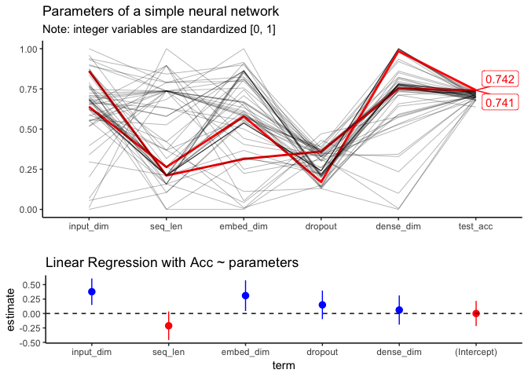

textlearnR
================

A simple collection of well working NLP models (Keras) in R, tuned and benchmarked on a variety of datasets. Work in progress and only supporting classification tasks (at the moment).


What can this package do for you? (in the future)
-------------------------------------------------

Training neural networks can be bothering and time consuming due to the sheer amount of hyper-parameters. Hyperparameters are values that a prior defined and provided as additional model input. Tuning those requires either deeper knowledge about the model behavior itself or computational resources for random searches or optimization on the parameter space. `textlearnR` provides a light weight framework to train and compare ML models from Keras, H2O, starspace and text2vec (comming soon). Furthermore, it allows to define parameters for text processing (max number of words and text length), which are also considered to be priors.

Beside language models, `textlearnR` also integrates third party packages for automatically tuning hyperparameters. The following strategies are avaiable:

#### Searching

-   Grid search
-   Random search
-   Sobol sequence (quasi-random numbers designed to cover the space more evenly than uniform random numbers). Computationally expensive but parallelizeable.

#### Optimization

-   [`mlrMBO`](https://github.com/mlr-org/mlrMBO) Bayesian and model-based optimization.
-   [`GA`](https://github.com/luca-scr/GA) Genetic algorithems for stochastic optimization.
-   Others:
    -   Nelder–Mead simplex (gradient-free)
    -   Particle swarm (gradient-free)

For constructing new parameter objects the tidy way, the package `dials` is used. Each model optimized is saved to a SQLite database in `data/model_dump.db`. Of course, committed to [tidy principals](https://cran.r-project.org/package=tidyverse/vignettes/manifesto.html). Contributions are highly welcomed!

Supervised Models
-----------------

[model overview](https://becominghuman.ai/cheat-sheets-for-ai-neural-networks-machine-learning-deep-learning-big-data-678c51b4b463)

<!-- * simple generic wrapper/class for models -->
<!-- * parameter validation using manual and automatic verifiaction dataset or k-Fold cross validation. -->
<!-- * Introduce early stopping to keras during training of model -->
``` r
keras_model <- list(
  simple_mlp = textlearnR::keras_simple_mlp,
  deep_mlp = textlearnR::keras_deep_mlp,
  simple_lstm = textlearnR::keras_simple_lstm,
  #deep_lstm = textlearnR::keras_deep_lstm,
  pooled_gru = textlearnR::keras_pooled_gru,
  cnn_lstm = textlearnR::keras_cnn_lstm,
  cnn_gru = textlearnR::keras_cnn_gru,
  gru_cnn = textlearnR::keras_gru_cnn,
  multi_cnn = textlearnR::keras_multi_cnn
)
```

Datasets
--------

-   [celebrity-faceoff](https://github.com/jlacko/celebrity-faceoff)
-   [Google Jigsaw Toxic Comment Classification](https://www.kaggle.com/c/jigsaw-toxic-comment-classification-challenge/data)
-   [Hate speech detection](https://github.com/t-davidson/hate-speech-and-offensive-language)
-   [nlp-datasets](https://github.com/niderhoff/nlp-datasets)
-   Scopus Classification
-   party affiliations

Understand one model
--------------------

``` r
textlearnR::keras_simple_mlp(
    input_dim = 10000, 
    embed_dim = 128, 
    seq_len = 50, 
    output_dim = 1
  ) %>% 
  summary
```

    ## ___________________________________________________________________________
    ## Layer (type)                     Output Shape                  Param #     
    ## ===========================================================================
    ## embedding_1 (Embedding)          (None, 50, 128)               1280000     
    ## ___________________________________________________________________________
    ## flatten_1 (Flatten)              (None, 6400)                  0           
    ## ___________________________________________________________________________
    ## dense_1 (Dense)                  (None, 128)                   819328      
    ## ___________________________________________________________________________
    ## dropout_1 (Dropout)              (None, 128)                   0           
    ## ___________________________________________________________________________
    ## dense_2 (Dense)                  (None, 1)                     129         
    ## ===========================================================================
    ## Total params: 2,099,457
    ## Trainable params: 2,099,457
    ## Non-trainable params: 0
    ## ___________________________________________________________________________

-   rather flowchart or ggalluvial




<!---

### Other NLP Data

* https://www.kaggle.com/mrisdal/fake-news/home
* [rpanama](https://github.com/dgrtwo/rpanama)
    + https://www.kaggle.com/zusmani/paradise-papers/home
* https://www.kaggle.com/shujian/arxiv-nlp-papers-with-github-link
* [`fulltext`](https://github.com/ropensci/fulltext)
* [rorcid](https://github.com/ropensci/rorcid)
* [roadoi](https://github.com/ropensci/roadoi)
* [manifestoR](https://github.com/ManifestoProject/manifestoR)


## Other NLP Resources

* https://www.kaggle.com/rtatman/stopword-lists-for-19-languages
* https://www.r-craft.org/r-news/regex-tutorial-with-examples/
* http://ruder.io/optimizing-gradient-descent/
* [good for explanations](https://beta.rstudioconnect.com/ml-with-tensorflow-and-r/#22)
* https://github.com/OmaymaS/stringr_explorer
* [Building a neural network from scratch in R](https://selbydavid.com/2018/01/09/neural-network/)

## Other NLP Packages

* [`decryptr` An extensible API for breaking captchas](https://github.com/decryptr/decryptr)
* [`textfeatures`](https://github.com/mkearney/textfeatures)
* [`dbx` A fast, easy-to-use database library for R](https://github.com/ankane/dbx)
* [`textreuse`](https://github.com/ropensci/textreuse)
* [Chunkwise Text-file Processing for 'dplyr'](https://github.com/edwindj/chunked)
* [iml: interpretable machine learning](https://github.com/christophM/iml)
* [ggfittext](https://github.com/wilkox/ggfittext)
* [loggr](https://github.com/smbache/loggr)
* [text generation with markov files](https://github.com/abresler/markovifyR)
* [rBayesianOptimization](https://github.com/yanyachen/rBayesianOptimization)
* [mlr3: Machine Learning in R - next generation](https://github.com/mlr-org/mlr3)
* [textclean](https://github.com/trinker/textclean)
* [quanteda: Multilingual Stopword Lists in R](http://stopwords.quanteda.io)
* [rematch2](https://github.com/MangoTheCat/rematch2)
* [telegram](https://github.com/lbraglia/telegram)
* [speedtest](https://github.com/hrbrmstr/speedtest)
* [preText](https://github.com/matthewjdenny/preText)
* [String operations the Python way: pystr](https://github.com/Ironholds/pystr)
* [A better dictionary class for R.](https://github.com/stefano-meschiari/dict)
* [book code](https://github.com/IronistM/Modern-Optimization-with-R)
* [textmineR](https://github.com/TommyJones/textmineR)
* [SuperLearner](https://github.com/ecpolley/SuperLearner) 

--->
